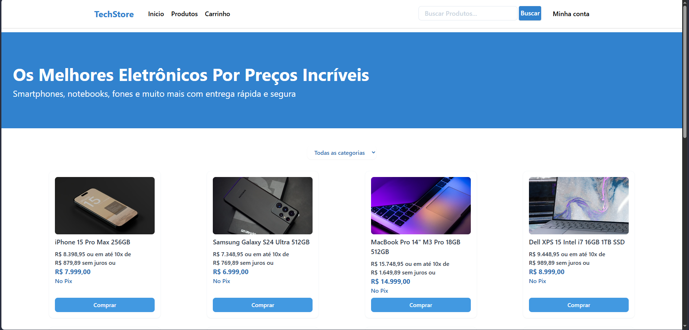

# TechStore — Full Stack E-commerce

A full stack e-commerce application for electronics, built with React, Node.js, and MySQL — deployed in production on Vercel and Railway.



🔗 **[Live Demo](https://ecommerce-full-stack-react-node-my.vercel.app)**

---

## Features

- Product listing with search and category filter
- Shopping cart with quantity control and CEP/shipping lookup
- User authentication (register and login)
- User profile with editable name, username, email and password
- Admin panel — add, edit and remove products
- Persistent cart via localStorage
- Fully responsive (mobile + desktop)

---

## Tech Stack

| Layer | Technology |
|---|---|
| Frontend | React, Tailwind CSS, React Router |
| Backend | Node.js, Express |
| Database | MySQL |
| Frontend Deploy | Vercel |
| Backend + DB Deploy | Railway |

---

## Architecture

```
User Browser
    │
    ▼
Vercel (React)           ← static build, REACT_APP_API_URL env var
    │
    │  HTTP requests
    ▼
Railway (Express API)    ← PORT assigned by Railway
    │
    │  private network
    ▼
Railway (MySQL)          ← mysql.railway.internal:3306
```

---

## Running Locally

**Prerequisites:** Node.js, npm

**1. Clone the repository**
```bash
git clone https://github.com/Americanoooo/Ecommerce-Full-Stack-React-Node-MySQL.git
cd Ecommerce-Full-Stack-React-Node-MySQL
```

**2. Backend** — create `backend/.env` with your Railway MySQL credentials:
```env
MYSQLHOST=your-proxy.railway.app
MYSQLUSER=root
MYSQLPASSWORD=your-password
MYSQLDATABASE=railway
MYSQLPORT=your-port
```
```bash
cd backend
npm install
npm run dev        # runs on port 3001
```

**3. Frontend** — create `frontend/.env.local`:
```env
REACT_APP_API_URL=http://localhost:3001
```
```bash
cd frontend
npm install
npm start          # runs on port 3000
```

Open [http://localhost:3000](http://localhost:3000).
